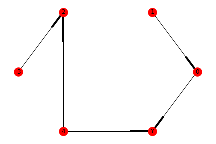
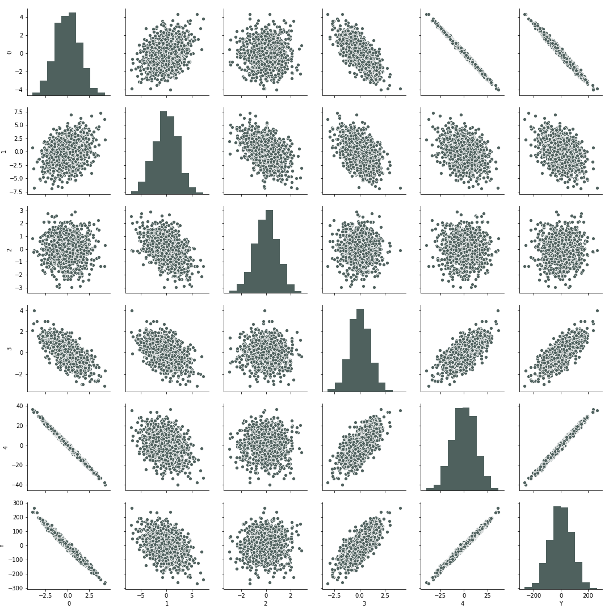
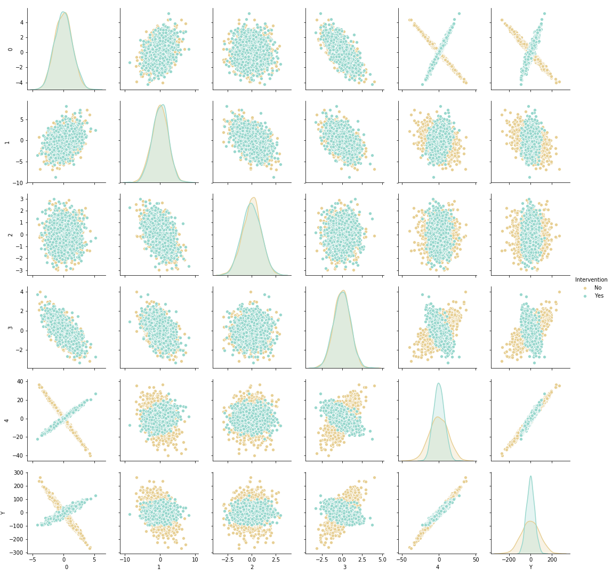

# Causal Graphs and Regression
Simulating random causal graphs for experimenting with various regression techniques. This is not finished, so it might take some tinkering to get working.

## TODO
* passing cutom dgp for individual variables
* Variyng functional relationship between variables
* binary outcomes
* Factor variables 

## Usage

the `CausalGraph` class simulates random causal graphs (these are directed and acyclic, although im not entirely sure if this is required). By default the generator is not seeded, but you can simply set a seed if you want to.
```python
from cgkit import CausalGraph

C = CausalGraph(n_continuous = 4,
                n_dummies = 1,
                density =0.8,
                seed = 5,
                parameter_space = lambda: np.random.randint(-10,11)
                )

C.draw_graph()
```
will yield a graph like

<p align="center">

</p>

Which shows the simulated causal relation between each variable. The class can handle both dummies and continuous variables. Parameters governing the relation between the variables are stored in `C.parameters` as a dictionary with one key for each variable. Within each key is then a dictionary of `{ancestor:parameter}` pairs

```
{'c0': {'c3': -1},
 'c1': {'c0': 0, 'c3': -1, 'c2': -1},
 'c2': {},
 'c3': {},
 'd0': {'c0': -9},
 'Y': {'c3': 8, 'c1': -3, 'd0': 6}}
```
The parameters are drawn randomly (in this case as integers between -10 and 10). We can simulate a row-column dataset with
```python
(X,y), df = C.yield_dataset(1000)
```
where X and y are numpy arrays, while df is a pandas dataframe containing both X and y. Plotting these variables will look like

<p align="center">

</p>

Next we can intervene on one of the parameters in the network using `pintervene`
```python
C.pintervene(effect = 4, cause = 0, parameter = 5)
(Xp,yp), dfp = C.yield_dataset(1000)
```
This code changes the parameter in the equation X0 = 5*X2 to a 2 (i.e. X0 = -5*X2). When overlaying the new and old dataset we get a figure like

<p align="center">

</p>


Running OLS on the original simulated dataset with _Y_ as the outcome yields accurate parameter estimates

<p align="center">

</p>
